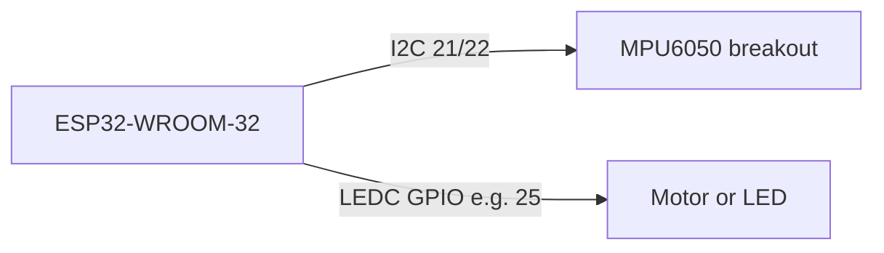

# Rust + ESP-IDF Quadcopter — Incremental Plan

## Strategy

Build **incrementally with quick wins first**. Each phase has a narrow scope, a concrete hardware setup, and pass/fail exit criteria before moving on. The existing C firmware in `[Firmware/esp-drone/](Firmware/esp-drone/)` stays as **reference only** — we port behavior, not files.

**End target:** ESP32-WROOM-32 (Xtensa, dual-core), Rust on ESP-IDF (`esp-idf-rs`), bare-metal-style flight loop (FreeRTOS underneath, stabilizer pinned to core 1).

**Near-term focus:** POC hardware on a devkit/breadboard to confirm Rust toolchain + drivers work before touching the full drone PCB or WiFi stack.

---

## POC hardware (Phases 0–2)

**Board:** Elegoo ESP32-WROOM-32 — `**POC_LEFT_HEADER` profile (all signals on left header, VIN bottom-left). Documented in `[docs/hardware/](docs/hardware/)`.

| Item        | Header / GPIO                                         |
| ----------- | ----------------------------------------------------- |
| Status LED  | **D27 / GPIO 27** (external LED; onboard D2 not used) |
| IMU I2C     | **D14 SDA, D13 SCL** (GPIO 14, 13)                    |
| Motor M1–M4 | **D32, D33, D25, D26** (GPIO 32, 33, 25, 26)          |
| 3V3 / GND   | Right **3V3** for IMU; **GND** on either header       |

Code: `[Firmware/esp-drone-rs/src/board/elegoo_esp32_wroom32.rs](Firmware/esp-drone-rs/src/board/elegoo_esp32_wroom32.rs)`

POC wiring diagram (minimal):



---

## Architecture (unchanged principle)

- **Stack:** `[esp-idf-sys](https://github.com/esp-rs/esp-idf-sys)` + `[esp-idf-hal](https://github.com/esp-rs/esp-idf-hal)` + `[esp-idf-svc](https://github.com/esp-rs/esp-idf-svc)` (WiFi deferred until Phase 4)
- **Target:** `xtensa-esp32-espidf`, ESP-IDF **5.3.x or 5.4.x**
- **Not** `esp-hal` (no_std) — you asked to keep ESP-IDF
- **Flight loop (Phase 3+):** 1 kHz task on APP CPU; comm/WiFi on PRO CPU when added

---

## Repo layout (start small, grow crates as needed)

```
Firmware/
  esp-drone/          # existing C — reference only
  esp-drone-rs/       # new Rust firmware
    Cargo.toml        # workspace (single binary crate OK for Phase 0–1)
    .cargo/config.toml
    sdkconfig.defaults
    drone/
      src/main.rs
    # add crates/ later: board, drivers, flight, comm
```

Phase 0 can be a **single crate**. Split into `board` / `drivers` / `flight` / `comm` when Phase 2 code size warrants it.

---

## Phase 0 — Rust on ESP32 works (quick win #1)

**Goal:** Prove WSL2 toolchain → build → flash → serial log on real hardware.

**Scope:**

- Scaffold from `[esp-rs/esp-idf-template](https://github.com/esp-rs/esp-idf-template)`, MCU `esp32`
- `sdkconfig.defaults`: 240 MHz, dual-core, 4 MB flash, no PSRAM
- `main.rs`: NVS init, boot banner, blink devkit LED (GPIO 2 on many DevKitC boards)

**Host setup:**

```bash
cargo install cargo-generate espup espflash ldproxy
espup install && source ~/export-esp.sh
cd Firmware/esp-drone-rs && cargo build
espflash flash --monitor target/xtensa-esp32-espidf/debug/drone
```

**Exit criteria:** Device boots, Rust log visible on monitor, LED blinks. **Stop here if this fails** — fix toolchain before any drivers.

**Effort:** ~0.5–1 day

---

## Phase 1 — POC drivers (quick wins #2 and #3)

Two small milestones; either order is fine, but **IMU first** is lower risk (no spinning parts).

### Phase 1a — MPU6050 over I2C

**Goal:** Confirm Rust I2C + register reads match reality.

**Scope:**

- Minimal MPU6050 driver (init, gyro/accel read, scales) — not full 3500-line C driver
- FreeRTOS task @ 100–250 Hz printing roll/pitch/yaw derived from accel (no fusion yet)
- Pins: SDA=21, SCL=22 unless your breakout differs

**Reference C:** `[mpu6050.c](Firmware/esp-drone/components/drivers/i2c_devices/mpu6050/mpu6050.c)`, sensor task in `[sensors_mpu6050_hm5883L_ms5611.c](Firmware/esp-drone/components/core/crazyflie/hal/src/sensors_mpu6050_hm5883L_ms5611.c)`

**Exit criteria:** Tilt the board → printed angles change smoothly; I2C address 0x68 detected.

**Effort:** ~1–2 days

### Phase 1b — LEDC PWM (motor or LED)

**Goal:** Confirm Rust can drive PWM the way `[motors.c](Firmware/esp-drone/components/drivers/general/motors/motors.c)` does.

**Scope:**

- One LEDC channel on a safe GPIO (e.g. 25)
- Serial command: `motor 0..100` sets duty cycle
- Optional: swap LED for one brushed motor on bench **with prop removed**

**Exit criteria:** Duty cycle changes motor/LED speed monotonically; no watchdog resets.

**Effort:** ~0.5–1 day

---

## Phase 2 — Bench quad + arming gate

**Goal:** All four motor channels work; safe arming semantics before closed-loop flight.

**Scope:**

- Extend LEDC to 4 channels — start with POC GPIOs, then switch to **ESPLANE_V1 motor pins** (4, 33, 32, 25) if using drone PCB
- Motor test chirp on arm (from C `motors.c` test tones)
- `board` module: `PocBoard` vs `EsplaneV1` pin profiles behind a feature flag
- Arming: disarmed by default; arm only via explicit serial command; disarm on any error

**Deferred:** attitude control, WiFi, battery ADC (optional stub)

**Exit criteria:** All 4 motors respond to manual throttle mix test; disarm kills PWM immediately.

**Effort:** ~2–3 days

---

## Phase 3 — Flyable MVP (closed loop)

**Goal:** Tethered hover with **serial setpoints** — first real flight on Rust, still no WiFi.

**Scope (port behavior from C, not line-by-line):**

| Component                     | C reference                                                                                                                                                                |
| ----------------------------- | -------------------------------------------------------------------------------------------------------------------------------------------------------------------------- |
| Complementary / Mahony fusion | `[sensfusion6.c](Firmware/esp-drone/components/core/crazyflie/modules/src/sensfusion6.c)`                                                                                  |
| PID attitude control          | `[controller_pid.c](Firmware/esp-drone/components/core/crazyflie/modules/src/controller_pid.c)`, `[pid.c](Firmware/esp-drone/components/core/crazyflie/modules/src/pid.c)` |
| X-quad mixer                  | `[power_distribution_stock.c](Firmware/esp-drone/components/core/crazyflie/modules/src/power_distribution_stock.c)`                                                        |
| 1 kHz stabilizer loop         | `[stabilizer.c](Firmware/esp-drone/components/core/crazyflie/modules/src/stabilizer.c)`                                                                                    |

**Also:**

- Stabilizer pinned to **core 1**, high priority
- Rate supervisor (loop timing watchdog)
- Serial setpoints: roll/pitch/yaw/thrust
- Low-battery disarm if ADC wired (optional for MVP)

**Explicitly out of scope:** Kalman, position hold, CRTP, param/log system, deck drivers, Xtensa DSP lib (use Rust `libm` instead)

**Exit criteria:** Tethered drone holds roughly level in angle mode; manual throttle controls altitude; disarm works instantly.

**Effort:** ~1–2 weeks

---

## Phase 4 — WiFi + CRTP (product control path)

**Goal:** Existing ESP-Drone mobile app works again.

**Scope:**

- WiFi AP: `ESP-DRONE` / `12345678`, UDP port **2390** (from `[wifi_esp32.c](Firmware/esp-drone/components/drivers/general/wifi/wifi_esp32.c)`)
- CRTP framing + RPYT commander (`[crtp.c](Firmware/esp-drone/components/core/crazyflie/modules/src/crtp.c)`, `[crtp_commander_rpyt.c](Firmware/esp-drone/components/core/crazyflie/modules/src/crtp_commander_rpyt.c)`)
- WiFi on core 0 → setpoint channel → stabilizer on core 1
- Link-loss timeout disarms

**Exit criteria:** Phone app controls flight; link loss disarms within timeout.

**Effort:** ~1–2 weeks

---

## Phase 5+ — Priority backlog (plan only until Phase 4 done)

Work these in order unless hardware needs dictate otherwise:

| Priority | Feature                                | C reference                                                                                                                                                         | Value                                                    |
| -------- | -------------------------------------- | ------------------------------------------------------------------------------------------------------------------------------------------------------------------- | -------------------------------------------------------- |
| P1       | Battery PM + auto-land thresholds      | `[pm_esplane.c](Firmware/esp-drone/components/core/crazyflie/hal/src/pm_esplane.c)`, `[adc_esp32.c](Firmware/esp-drone/components/drivers/general/adc/adc_esp32.c)` | Safety for real flights                                  |
| P2       | Status LEDs + boot sequences           | `[led_esp32.c](Firmware/esp-drone/components/drivers/general/led/led_esp32.c)`, `[ledseq.c](Firmware/esp-drone/components/core/crazyflie/hal/src/ledseq.c)`         | User feedback                                            |
| P3       | Buzzer / sound cues                    | `[buzzer.c](Firmware/esp-drone/components/core/crazyflie/hal/src/buzzer.c)`                                                                                         | Arming feedback                                          |
| P4       | Magnetometer + baro (HMC5883L, MS5611) | deck I2C drivers                                                                                                                                                    | Better heading / altitude                                |
| P5       | Kalman estimator                       | `[estimator_kalman.c](Firmware/esp-drone/components/core/crazyflie/modules/src/estimator_kalman.c)`                                                                 | Smoother state est.                                      |
| P6       | Position hold (PMW3901 flow deck)      | `[pmw3901/](Firmware/esp-drone/components/drivers/spi_devices/pmw3901/)`                                                                                            | Indoor hover hold                                        |
| P7       | Runtime param/log tuning               | `[param.c](Firmware/esp-drone/components/core/crazyflie/modules/src/param.c)`, `[log.c](Firmware/esp-drone/components/core/crazyflie/modules/src/log.c)`            | Dev tooling — replace with simpler NVS + structured logs |
| P8       | ESP-NOW radio control                  | not in C tree                                                                                                                                                       | Alternative to WiFi app                                  |
| P9       | ESP-FLY S3 pin profile                 | `TARGET_ESP32_S2_DRONE_V1_2` in Kconfig                                                                                                                             | If targeting XIAO S3 hardware later                      |

---

## What we are NOT doing early

- Full ~405-file C port
- Xtensa DSP library port (~14k LOC) — use Rust math instead
- WiFi before Phase 4
- Full drone PCB pinout before Phase 1 POC passes (unless you already have PCB wired)
- Kalman / position hold before MVP flies

---

## ESP32-WROOM-32 notes

- 4 MB flash typical; disable PSRAM in sdkconfig
- ADC1 only when WiFi active (Phase 4+)
- Avoid strapping pins 0, 2, 12, 15 for outputs that boot incorrectly
- Dual-core: `CONFIG_FREERTOS_UNICORE=n`

---

## Risks

| Risk                     | Mitigation                                                     |
| ------------------------ | -------------------------------------------------------------- |
| Toolchain pain on WSL2   | Phase 0 is a hard gate; use `espup` + project in WSL home dir  |
| POC wiring ≠ drone PCB   | `board` trait with `PocBoard` / `EsplaneV1` profiles           |
| Scope creepmaina.        | Each phase has exit criteria; no WiFi until Phase 4            |
| GPL on ported algorithms | Mark ported modules; retain LICENSE when copying control logic |

---

## First PR after plan approval (Phase 0 + Phase 1a only)

Keep the first PR **small**:

1. Add `Firmware/esp-drone-rs/` — template scaffold, `esp32` target
2. Boot banner + LED blink (Phase 0)
3. MPU6050 I2C read + serial stream (Phase 1a)

Motor PWM and everything else lands in follow-up PRs once IMU POC is confirmed on hardware.

**Total estimate:** Phase 0–1 ~2–4 days with devkit in hand; Phase 2–3 ~2–3 weeks; Phase 4+ ~2–4 weeks depending on backlog priorities.
